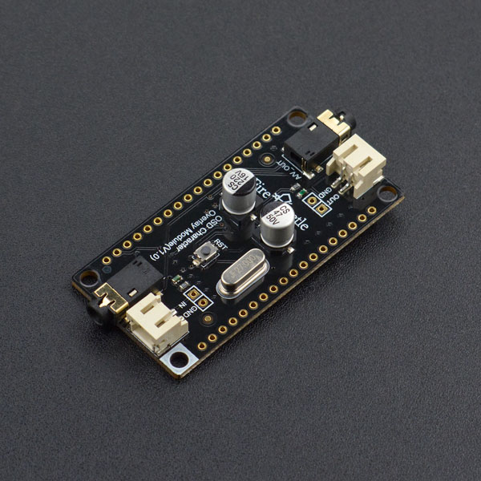

# DFRobot_OSD
* [中文版](./README_CN.md)

OSD is the abbreviation of On-screen Display, this is a screen menu adjustment display technology to add different menu-style characters on the screen display.

FireBeetle OSD Character Overlay Module is a new product presented by DFRobot. It adopts AT7456E OSD chip. This is a single-channel OSD module, equipped with functions like video drive, sync separator, video separate switch, etc. It comes with 512 bytes EEPROM user-defined storage space. After connected to video sources (AV Signals), the display covers 540x192 pixels which can show 16x30 characters on the screen. Users can also call font library to show characters and images.

This FireBeetle OSD Character Overlay Module is compatible with FireBeetle series interfaces and can be directly plugged into FireBeetle mainboards. This module can be widely applied to device character display and time display of monitor device such as road cameras, home automation.




## Product Link (https://www.dfrobot.com/product-1700.html)
    SKU: DFR0515


## Table of Contents

* [Summary](#summary)
* [Installation](#installation)
* [Methods](#methods)
* [Compatibility](#compatibility)
* [History](#history)
* [Credits](#credits)


## Summary

* This is a Library for OSD,the function is the superposition of characters.And You can display certain characters on screen.


## Installation

There two methods:

1. To use this library, first download the library file, paste it into the \Arduino\libraries directory, then open the examples folder and run the demo in the folder.
2. Search the DFRobot_OSD library from the Arduino Software Library Manager and download it.


## Methods

```C++

  /**
   * @fn DFRobot_OSD
   * @brief Constructor
   * @param CS -  CS selection pin
   * @return None
   */
  DFRobot_OSD(int CS);
  ~DFRobot_OSD();

  /**
   * @fn init
   * @brief Init function
   * @return None
   */
  void init();

  /**
   * @fn displayChar
   * @brief display char
   * @param row - Horizontal coordinate, range(0,15)
   * @param col - Vertical coordinate, range(0,29)
   * @param value - addr of char in eeprom
   * @return None
   */
  void displayChar(unsigned char row, unsigned char col, unsigned short addr);

  /**
   * @fn displayChar
   * @brief display string
   * @param row - Horizontal coordinate, range(0,15)
   * @param col - Vertical coordinate, range(0,29)
   * @param s - String
   * @return None
   */
  void displayString(unsigned char row, unsigned char col, const char *s);
  void displayString(unsigned char row, unsigned char col, String s);

  /**
   * @fn clear
   * @brief Clear screen
   * @return None
   */
  void clear(void);

  /**
   * @fn storeChar
   * @brief Write the custom character to the OSD, replacing the original character
   * @param addr - Address of the stored character
   * @param dt - Array generated through the tool
   * @return None
   */
  void storeChar(unsigned short addr,int dt[]);

```


## Compatibility

MCU                  | Work Well    | Work Wrong   | Untested    | Remarks
-------------------- | :----------: | :----------: | :---------: | :----:
FireBeetle-Board328P |      √       |              |             |
FireBeetle-ESP8266   |      √       |              |             |
FireBeetle-ESP32     |      √       |              |             |
Arduino Leonardo     |      √       |              |             |


## History

- 2017-9-27 - Version 1.0.0 released.


## Credits

Written by Luyuhao(yuhao.lu@dfrobot.com), 2017. (Welcome to our [website](https://www.dfrobot.com/))

