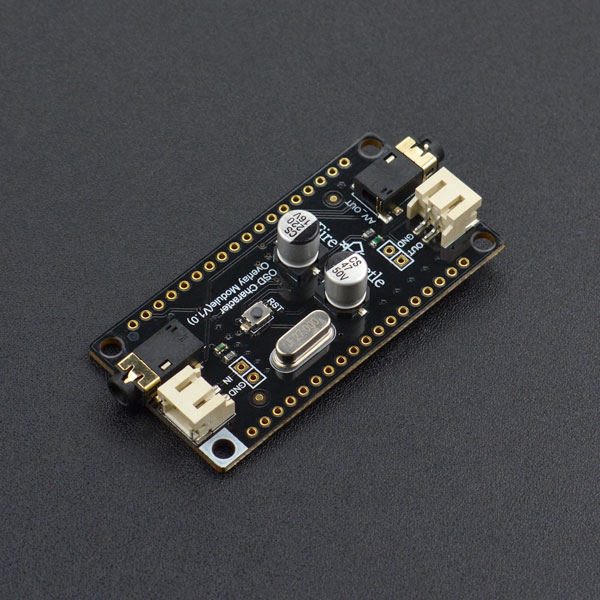

# DFRobot_OSD
* [English Version](./README.md)

OSD是On-screen Display的简称，即屏幕菜单式调节方式。这是一种在屏幕上附加各类菜单式字符的技术。DFRobot新推出的OSD视频字符叠加模块，采用AT7456E高性能视频字符叠加芯片，该芯片集成了512Byte的EEPROM用户自定义存储空间，是一款单通道、单色随屏显示发生器，具备视频驱动、同步分离器、视频分离开关等功能。在接入视频源后（AV信号），可在视频上覆盖一层540x192像素点，可显示16x30个字符。用户可调取字库来显示相应文字或图案。 Firebeetle OSD字符叠加模块，兼容FireBeetle萤火虫接口，可以直接插接在FireBeetle萤火虫系列主板上。




## 产品链接 (https://www.dfrobot.com.cn/goods-1604.html)
    SKU: DFR0515


## 目录

* [概述](#概述)
* [库安装](#库安装)
* [方法](#方法)
* [兼容性](#兼容性)
* [历史](#历史)
* [创作者](#创作者)


## 概述

* 这是一个用于OSD的库，函数是字符的叠加。你可以在屏幕上显示某些字符


## 库安装

这里有2种安装方法：

1. 使用此库前，请首先下载库文件，将其粘贴到\Arduino\libraries目录中，然后打开examples文件夹并在该文件夹中运行演示。
2. 直接在Arduino软件库管理中搜索下载 DFRobot_OSD 库。


## 方法

```C++

  /**
   * @fn DFRobot_OSD
   * @brief Constructor
   * @param CS -  CS selection pin
   * @return None
   */
  DFRobot_OSD(int CS);
  ~DFRobot_OSD();

  /**
   * @fn init
   * @brief Init function
   * @return None
   */
  void init();

  /**
   * @fn displayChar
   * @brief display char
   * @param row - Horizontal coordinate, range(0,15)
   * @param col - Vertical coordinate, range(0,29)
   * @param value - addr of char in eeprom
   * @return None
   */
  void displayChar(unsigned char row, unsigned char col, unsigned short addr);

  /**
   * @fn displayChar
   * @brief display string
   * @param row - Horizontal coordinate, range(0,15)
   * @param col - Vertical coordinate, range(0,29)
   * @param s - String
   * @return None
   */
  void displayString(unsigned char row, unsigned char col, const char *s);
  void displayString(unsigned char row, unsigned char col, String s);

  /**
   * @fn clear
   * @brief Clear screen
   * @return None
   */
  void clear(void);

  /**
   * @fn storeChar
   * @brief Write the custom character to the OSD, replacing the original character
   * @param addr - Address of the stored character
   * @param dt - Array generated through the tool
   * @return None
   */
  void storeChar(unsigned short addr,int dt[]);

```


## 兼容性

MCU                  | Work Well    | Work Wrong   | Untested    | Remarks
-------------------- | :----------: | :----------: | :---------: | :----:
FireBeetle-Board328P |      √       |              |             |
FireBeetle-ESP8266   |      √       |              |             |
FireBeetle-ESP32     |      √       |              |             |
Arduino Leonardo     |      √       |              |             |


## 历史

- 2017-9-27 - 1.0.0 版本


## 创作者

Written by Luyuhao(yuhao.lu@dfrobot.com), 2017. (Welcome to our [website](https://www.dfrobot.com/))

